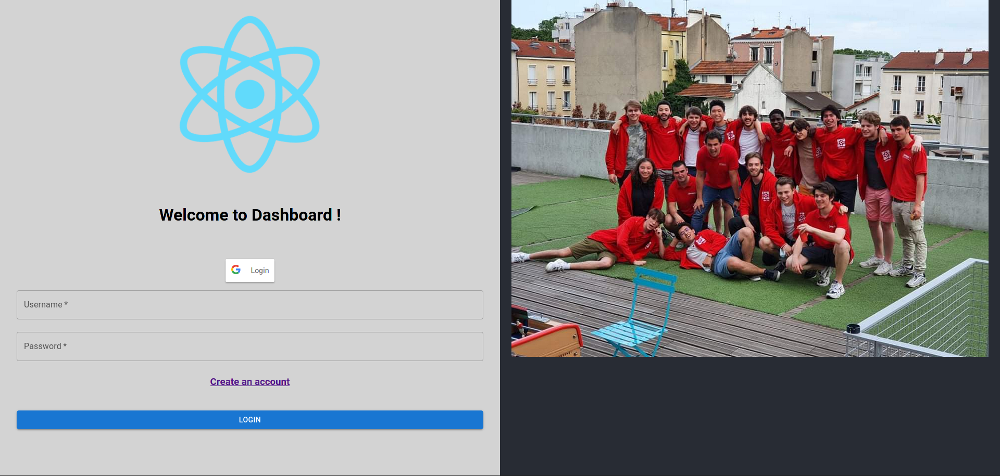
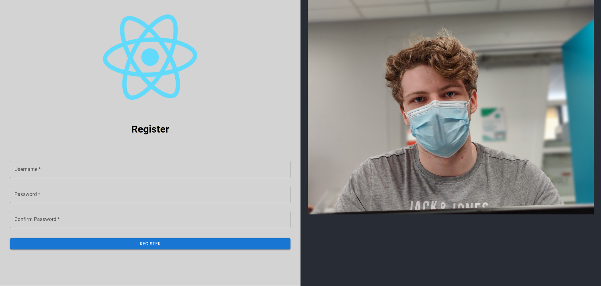
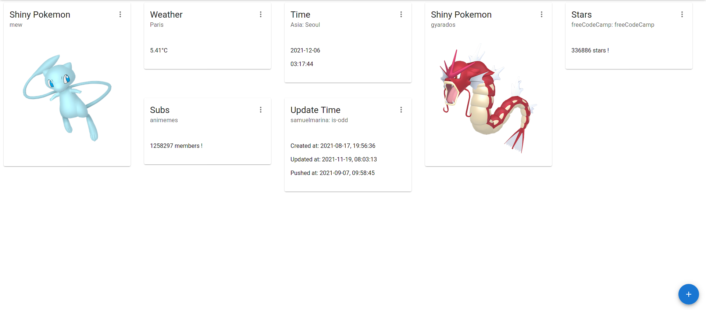
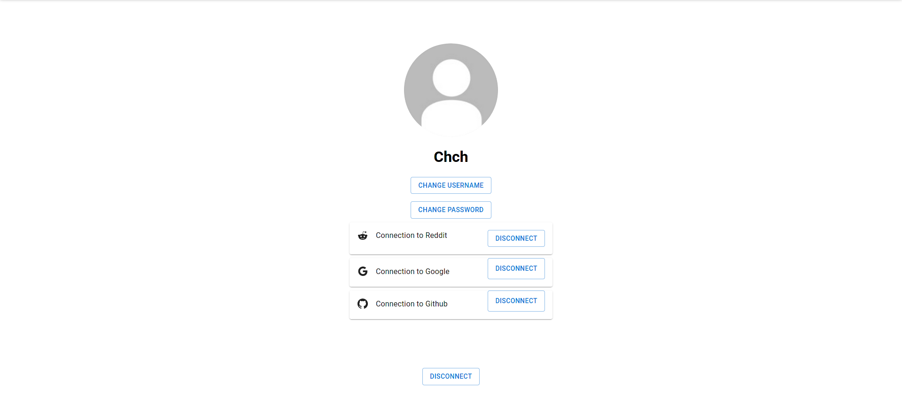

# B-DEV-500-PAR-5-1-dashboard-charlie-chou

# Presentation

The goal of this project is to create a customisable dashboard with our own feature.

We decided to use postgresql for the db, nestJs for the back and reactJS for the front.

# Installation
<p align="center">
  <a href="https://www.postgresql.org/download/">
    
  </a>
</p>
<p align="center">
  <a href="https://docs.nestjs.com/">
    
  </a>
</p>
<p align="center">
  <a href="https://fr.reactjs.org/tutorial/tutorial.html">
    
  </a>
</p>

# Lunching
to lunch the app:

```bash
docker-compose build && docker-compose up
```

to stop the app:

```bash
docker-compose down
```

to clear database data:

```bash
docker-compose down --volumes
```

to generte back-end doc (run from api folder):

```bash
npx @compodoc/compodoc -p tsconfig.json -s
```

<h1>Previews</h1>
<details>
    <summary>Login</summary>
    
</details>
<details>
    <summary>Register</summary>
    
</details>
<details>
    <summary>Home</summary>
    
</details>
<details>
    <summary>Parameters</summary>
    
</details>
<br>

## Contributors

- Arthur Fouquet [![github-link][github-logo]](https://github.com/arthur-fouquet)
- Charlie Chou [![github-link][github-logo]](https://github.com/Chch270)


[Github-logo]: https://img.shields.io/badge/GitHub-100000?style=for-the-badge&logo=github&logoColor=white